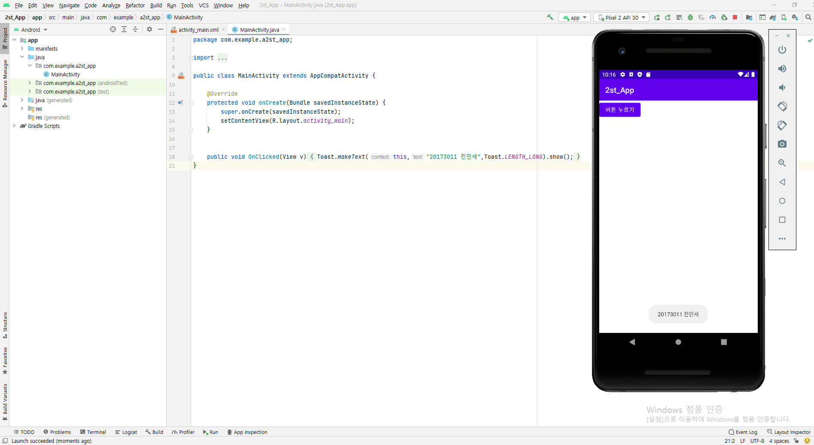
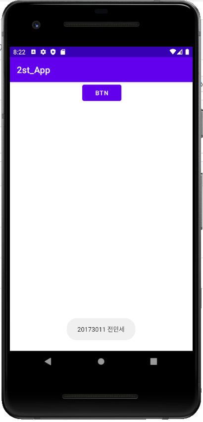
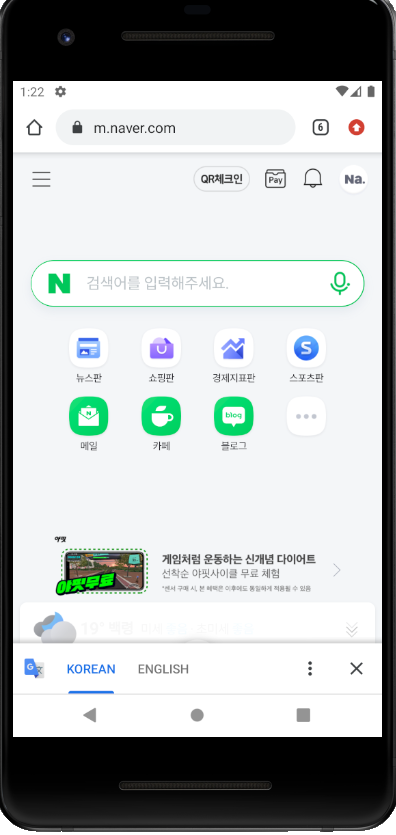
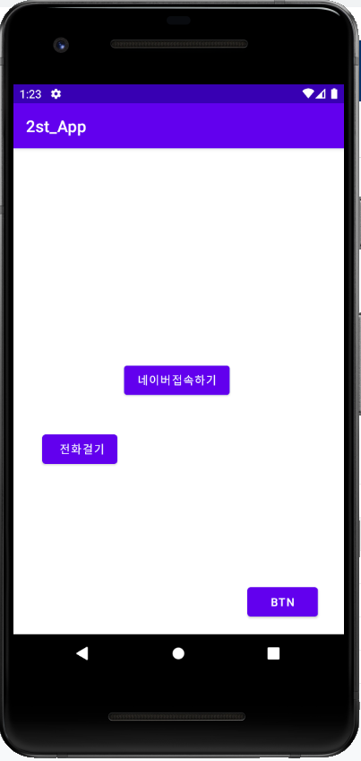
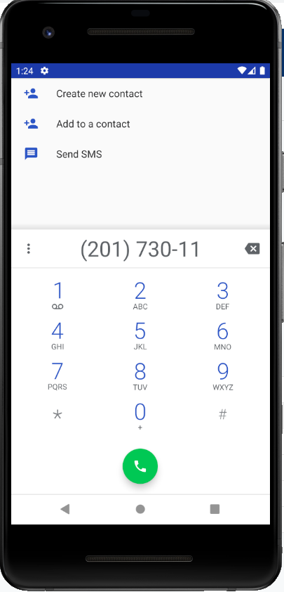

# 20173011 전민세

## 1주차 과제

## 2주차 과제 + 2주차 복습과제
2주차때의 과제는 https://github.com/minsejeon/20173011_jms_androidApp/blob/main/%EC%BA%A1%EC%8A%A4%ED%86%A4%EB%94%94%EC%9E%90%EC%9D%B82%EC%A3%BC%EC%B0%A8%EA%B3%BC%EC%A0%9C.png 이곳에 업로드 되어있습니다. 감사합니다.
  - Github사용법
</img>
</img>
</img>

## 3주차 과제
</img>
</img>
</img>

## 4주차 과제

   - 아이디어 명 : 사진에 적용할 필터를 직접 제작하여 다른 사람들과 공유할 수 있으며 사진 편집 기능, 업스케일링(Upscaling) 기술을 탑재한 화질 개선 기능 등의 특징을 가진 사진 편집 어플
   - 설명 : 사용자가 직접 사진에 적용할 필터를 제작하여 다른 사람들과 공유할 수 있다. 직접 제작하거나 다른 사람들이 공유한 필터를 어플에 저장할 수 있으며 자주 사용하는 필터를 위한 즐겨찾기 기능을 탑재한다. 사진 뿐만 아니라 휴대폰에 저장되어 있는 동영상에도 필터를 적용하거나 BGM 넣기, 동영상 자르기 등 동영상 편집을 위한 기능도 있다. 스마트폰으로 포토샵을 할 수 있는 PicsArt 어플과 필터를 직접 제작하여 저장할 수 있는 Polarr 어플을 사용하고 감명을 받아 이 아이디어를 도출하게 되었다. PC에서 사용할 수 있는 Adobe Photoshop 프로그램의 다양한 사진 편집 시스템을 바탕으로 이 어플은 동영상, 사진의 화질 개선도 가능하다. 특히 이 어플의 가장 큰 장점이라고 할 수 있는 업스케일링(Upscaling)은 이미지를 구성하는 각 픽셀 사이를 넓히고 그 사이에 각각 새로운 픽셀들을 끼워넣어 보다 높은 해상도를 구축할 수 있는 기술이다. 시중에는 동영상 및 사진 편집, WaifuX 나 Remini 등의 화질 개선, 필터 제작 기능이 한번에 들어간 어플을 찾기 어렵기 때문에 이 어플을 사용하여 평소 찍은 사진이나 갤러리에 있는 사진을 원하는 분위기에 맞춰 직접 제작한 필터를 적용하고 편집한 뒤 화질을 개선시키면 매우 유용할 것이다.
 
